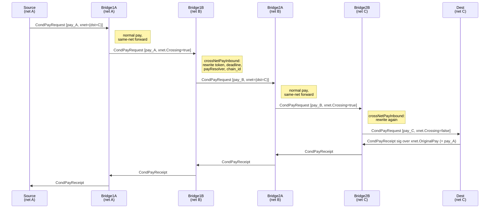

# Cross-Net Payment Forwarding

This document describes how the off-chain backend forwards a payment across two
or more *nets*. It complements the contract docs (which cover what each chain
enforces locally) and the routing-table reference (which covers the operator
config surface). It exists because the cross-net flow is not visible from any
single source file: the design choices live across `messager/`,
`handlers/msghdl/`, `cnode/multiserver.go`, the `xnet` proto envelope, and the
operator-supplied routing tables.

The companion `agent-pay-docs` repo does not currently cover this layer, so
take the present document as the authoritative reference for the off-chain
side. On-chain replay protection (chain id / ledger address / pay resolver)
is described in `agent-pay-contracts/docs/contracts.md`; this doc cites it
where it interacts with the off-chain flow but does not restate it.

---

## What a "net" is

A net is identified by `(chainId, AgentPayLedger)`. Given a `AgentPayLedger`
deployment on a chain, every other contract in the net is derivable: the
ledger's constructor binds `NativeWrap` (the chain's WETH-style wrapped-
native contract), `PayRegistry`, and `AgentPayWallet`, and the `PayResolver`
that feeds that `PayRegistry` (with its bound `VirtResolver`) is uniquely
determined per deployment.

Two OSPs are in the same net iff they boot against the same `AgentPayLedger`
address on the same chain. Channels can only be opened within a single net;
cross-net pays travel between OSPs in different nets via bridge OSPs.

Two `AgentPayLedger`s on the same chain are independent state machines with
disjoint channel namespaces — so they are different nets even though they
share `chainId`.

`netId` is an operator-assigned `uint64` label for that tuple. It is stored
in a single kv row at [storage/dal.go::PutNetId](../storage/dal.go) and is set
by the `ospcli -dbupdate config-xnet` command from a JSON config (see
[tools/osp-cli/cli/cli_db_update_xnet.go](../tools/osp-cli/cli/cli_db_update_xnet.go)).
There is no auto-init: an OSP that the operator never ran the xnet config cli
on returns "not found" from `dal.GetNetId()`, and the cross-net code paths
short-circuit (e.g. `if dstNetId != 0` in
[cnode/pay.go](../cnode/pay.go)).

Why `netId` is decoupled from `block.chainid`:

1. **Contract upgrades on the same chain.** A `AgentPayLedger` redeployment
   produces a new net even though `chainId` is unchanged — the new ledger
   enforces `initializer.ledger_address == address(this)` and the matching
   `PayResolver` enforces `pay.payResolver == address(this)`, so signed
   messages from the old ledger don't validate against the new one. A bridge
   pair can carry pays across the upgrade window with each side configured
   for a different net that happens to share `chainId`.
2. **Test harnesses.** `TestE2ECrossNet` deploys three independent
   `AgentPayLedger`s on a single geth instance and routes pays across them as
   three distinct nets. Without the netId / chainId decoupling, the test
   couldn't exist without spinning up three geth processes.

In production, most deployments will have netId in 1:1 correspondence with
chainId. The decoupling is load-bearing for upgrade scenarios and tests.

---

## Bridge pair trust model

A net boundary is crossed by exactly one bridge pair: two OSP processes, one
in each adjacent net, **operated as a single trust unit**. In production this
means same business entity, or two entities with strong off-chain agreement
(escrow, periodic net-out, etc.).

The cross-bridge link is **not a payment channel**. The two bridges live on
different chains and cannot share a `AgentPayLedger` channel. They communicate
over a direct gRPC stream (the `CelerStream` they hold for normal peer
messaging, with the `MultiServer.FwdMsg` RPC as a fallback for messages that
need to land on a specific OSP host within a multi-host deployment).

There is no shared on-chain state between bridgeA and bridgeB. Settlement
between them is **off-protocol**:

- On net A, the source funded bridgeA's incoming channel. BridgeA's net-A
  books show a credit owed.
- On net B, bridgeB paid the destination from its outgoing channel. BridgeB's
  net-B books show a debit it absorbed.
- Reconciliation between the two bridges is by business agreement, off-chain.

This shapes the protocol's failure modes:

- BridgeA could pocket the source's funds and tell bridgeB nothing.
- BridgeB could refuse to forward, or rewrite the pay's destination, or
  withhold the destination's receipt.
- Neither bridge has on-chain recourse against the other.

The protocol's job is to keep the cross-net flow working when both bridges
behave honestly, not to police them. Don't add code that assumes
cross-bridge accountability — the abstraction doesn't support it.

---

## End-to-end flow

The diagram below shows source `S` paying destination `D` across three nets,
through bridge pairs `(B1a, B1b)` and `(B2a, B2b)`. Each bridge pair is one
trust unit.



What happens at each kind of hop:

- **S → B1a (same-net forward).** Standard cond-pay request on the
  S↔B1a channel. `xnet.Crossing` is false. B1a runs the normal validators
  (`verifyCondPayRequest`, including the `pay.chainId == config.ChainId` check
  added in this PR). The pay is appended to B1a's pending list; the simplex
  state is co-signed.
- **B1a → B1b (cross-bridge link).** The messager hits the
  `xnet.Crossing = true` branch in
  [getPayNextHop](../messager/send_cond_pay_request.go) (because the next
  bridge is in a different net). [sendCrossNetPay](../messager/send_cond_pay_request.go)
  delivers the existing pay bytes to B1b via `streamWriter.WriteCelerMsg`. No
  channel state is updated on this hop — B1a and B1b have no shared channel.
- **B1b receives a crossing request.** The dispatcher routes it through
  [crossNetPayInbound](../handlers/msghdl/handle_cond_pay_request.go), which:
  1. Clones the original pay.
  2. Maps the token: looks up
     `dal.GetLocalToken(bridgeNetId, originalToken)` in the
     `nettoken` table to translate the source net's ERC20 address into net B's
     local ERC20 address.
  3. Sets `ResolveDeadline = now + xnet.Timeout`.
  4. Sets `ResolveTimeout = config.PayResolveTimeout`.
  5. Sets `PayResolver = my net's PayResolver address`.
  6. Sets `ChainId = config.ChainId.Uint64()` (= net B's chain id).
  7. Inserts an `XNET_INGRESS` bookkeeping row keyed by the new pay id, with
     a backpointer to `originalPayId`.
  8. Clears `xnet.Crossing` and replaces `frame.Message` with a fresh
     `CondPayRequest` carrying the rewritten pay bytes. Processing falls
     through to the regular forward path.
- **B1b forwards within net B.** Same as the source side: normal cond-pay
  request to the next hop on B1b's outgoing channel. The simplex state is
  signed using B1b's signature; B1b is now economically committed in net B.
- **Subsequent hops** repeat the same pattern until the pay arrives at the
  destination's local OSP, which delivers via `CondPayReceipt`.

---

## What's preserved vs. what's rewritten

When a bridge handles a crossing pay, these fields are **rewritten**:

| Field            | Why                                                                    |
|------------------|------------------------------------------------------------------------|
| token            | Each net has its own ERC20 deployment; the bridge maps src→local token |
| resolveDeadline  | Each leg of the journey gets its own deadline, shorter than upstream's |
| resolveTimeout   | Set to the local node's `PayResolveTimeout`                            |
| payResolver      | Must match the local PayResolver contract (`pay.payResolver == address(this)` is enforced on-chain) |
| chainId          | Must match `block.chainid` for on-chain resolve to succeed             |

These are **preserved**:

| Field            | Why                                                                |
|------------------|--------------------------------------------------------------------|
| src, dest        | The end-to-end identities of the original pay                      |
| conditions       | The condition contracts the source signed for                       |
| transferFunc     | The condition logic / max transfer amount                           |
| pay_timestamp    | Used together with src/dest as the source-side uniqueness key       |

The original pay bytes are kept verbatim in `xnet.OriginalPay` so the
destination can sign a receipt over them. The receipt-loop verification at the
source end depends on `xnet.OriginalPay` matching the original pay byte-for-byte.

---

## The receipt loop

When the destination's local OSP receives a crossing pay where it is the dst
network, the pay-request handler in
[condPayRequestOutbound](../handlers/msghdl/handle_cond_pay_request.go)
detects this (`myNetId == xnet.DstNetId`) and replies with a
`CondPayReceipt`. The receipt's signature is **over the original pay bytes**
from `xnet.OriginalPay`, not over the rewritten pay the destination's local
OSP saw on the wire.

This matters because the source's verifier is rooted in the source chain's
contract domain. The source signed an `entity.ConditionalPay` with its own
chain id, its own `payResolver`, its own deadline. To verify the receipt, the
source needs the destination to sign over those exact bytes. Having each
bridge along the path produce its own signature (or having the destination
sign the rewritten pay) wouldn't help — the source would have to chase the
signing keys of every bridge, which defeats the trust model.

[verifyCrossNetPay](../handlers/msghdl/handle_cond_pay_request.go) on the
destination side checks that the rewritten pay matches the original after
zeroing the legitimately-different fields:

```go
normalize := func(p *entity.ConditionalPay) {
    p.ResolveDeadline = 0
    p.ResolveTimeout = 0
    p.PayResolver = nil
    p.ChainId = 0
}
```

If a bridge tampered with `src`, `dest`, `conditions`, `transferFunc`, or the
amount, the normalization wouldn't hide it and the destination refuses to
sign the receipt.

What the receipt proves to the source: the destination acknowledged the
original pay. What it does not prove: that any specific bridge along the way
behaved honestly. A misbehaving bridge could withhold the receipt entirely,
in which case the source eventually times out and resolves on its first-hop
channel — that resolution happens in the source's net against the source's
contracts and is unaffected by anything the bridges did.

---

## Pay-settle on the cross-bridge link

The settle flow is symmetric. When a bridge wants to clear an `XNET_EGRESS`
pay (one it forwarded across a net boundary), it issues a
`PaymentSettleRequest` to its bridge counterpart over the same gRPC stream
the cond-pay request used. This is in
[sendCrossNetPaySettleRequest](../messager/send_pay_settle_request.go). Like
the cond-pay request, it does not update channel state — the two bridges
have no channel between them.

---

## Routing tables

Each OSP keeps four tables in its DAL, all populated by
`ospcli -dbupdate config-xnet -file <json>`:

| Table             | Key → Value                                                |
|-------------------|------------------------------------------------------------|
| `netid`           | (singleton) `myid` → my own net id                         |
| `netbridge`       | bridge OSP eth address → that OSP's net id                 |
| `bridge_routing`  | dst net id → next-hop bridge addr (from my net's POV)      |
| `nettoken`        | local ERC20 addr → (remote net id → remote ERC20 addr)     |

The protobuf JSON shape is in
[tools/osp-cli/cli/cli_db_update_xnet.go](../tools/osp-cli/cli/cli_db_update_xnet.go);
sample configs are in
[testing/profile/crossnet/](../testing/profile/crossnet/). For the topology
`o1=o2 - o6=o7 - o8=o9` (three nets, bridge pairs at the boundaries), o6's
config looks like:

```json
{
    "net_id": 1001,
    "net_bridge": {
        "<o2_addr>": 1000,
        "<o7_addr>": 1001
    },
    "bridge_routing": {
        "1000": "<o2_addr>",
        "1002": "<o7_addr>"
    },
    "net_token": {
        "<net_1001_token_addr>": {
            "1000": "<net_1000_token_addr>",
            "1002": "<net_1002_token_addr>"
        }
    }
}
```

Reading this:

- I am in net 1001.
- I know that o2 is a bridge into net 1000, and o7 is a bridge into net 1001
  (i.e. o7 is my same-net peer that bridges out — the two-entries-per-bridge
  pattern is how the routing decision identifies whether the next hop is in
  my net or across a boundary).
- To reach destinations in net 1000, route via o2; to reach net 1002, via o7.
- For my local ERC20 (net 1001), the equivalent token in net 1000 is X, and
  in net 1002 is Y. The bridge's `nettoken` lookup uses these to map a pay's
  token between adjacent nets.

The decision tree in
[getPayNextHop](../messager/send_cond_pay_request.go) walks these tables:
"do I belong in dst net? if not, who do I send to?" with the
`xnet.Crossing = true` flag set when the next hop is in a different net.

---

## Operational surface

When an operator adds a new net, they:

1. Deploy the contract set (or designate an existing deployment).
2. Pick a netId. Anything unused. By convention, 1:1 with chainId for
   single-net-per-chain deployments; pick a fresh number for upgrade-migration
   scenarios.
3. Stand up bridge OSPs in both nets to be connected. Each bridge needs:
   - A profile JSON pointing at its net's contract set.
   - A `CelerStream` registered with its counterpart bridge in the other net
     (configured via the admin `RegisterStreamRequest` API; see
     [test/e2e/e2e_crossnet_test.go::setMultiNet](../test/e2e/e2e_crossnet_test.go)
     for the shape of those calls).
4. Update each existing OSP's `bridge_routing` and `nettoken` tables via
   `ospcli -dbupdate config-xnet` so payments to the new net's address space
   know how to find the new bridge.
5. Ensure the bridges have channels open with their local same-net peers
   (otherwise a crossing pay arriving at the bridge has nowhere to forward).

When an operator retires a net, they:

1. Drain pending pays through the bridge, then stop accepting new pays.
2. Delete the bridge entries from peers' `netbridge` / `bridge_routing` /
   `nettoken` tables (`ospcli -dbupdate ...` with the corresponding
   `delete-*` subcommands).
3. Reconcile any outstanding bridge balance off-protocol.

Adding a net does not require a coordinated upgrade across the existing
network: peers that haven't installed the new routes simply can't address the
new net. Pays to existing nets continue uninterrupted.

---

## Test coverage and known gaps

The e2e suite at
[test/e2e/e2e_crossnet_test.go](../test/e2e/e2e_crossnet_test.go) exercises
`crossNetSendEth` and `crossNetSendErc20` across three nets. Run with:

```
go test ./test/e2e -run '^TestE2ECrossNet$' -count=1 -timeout 30m -v -args -multinet
```

Important caveat: the test runs all three nets against a single geth instance
(chain id 1337) and distinguishes them only by deploying separate contract
sets. This means:

- `pay.ChainId` is the same across all hops, so the chain-id rewrite at
  bridges and the chain-id check at receivers are not actually exercised by
  this test.
- The `walletId` derivation (which now hashes in `chainid`) is exercised, but
  with the same chainId on both sides — a true cross-chain bug in the hash
  would not be caught.
- Token-address translation (the `nettoken` table) **is** exercised because
  each contract set deploys its own ERC20 at a distinct address.

A future test infrastructure pass should add a multi-geth harness (one geth
per net, distinct chainIds via `--networkid`) so chain-id-specific cross-chain
semantics get coverage. This is a moderate test-only refactor — the
`SetupOnChain` function already takes a `groupId` parameter; extending it to
also take an RPC endpoint per group is the main change.

---

## Quick references

- Wire envelope: `CrossNetPay` in
  [proto/message.proto](../proto/message.proto)
- Routing decisions: [messager/send_cond_pay_request.go](../messager/send_cond_pay_request.go)
  (`getPayNextHop`, `sendCrossNetPay`)
- Bridge inbound rewrite: [handlers/msghdl/handle_cond_pay_request.go](../handlers/msghdl/handle_cond_pay_request.go)
  (`crossNetPayInbound`, `verifyCrossNetPay`)
- Cross-bridge transport: [cnode/multiserver.go](../cnode/multiserver.go)
  (`MultiServer.FwdMsg`, fallback to `streamWriter.WriteCelerMsg`)
- Operator config: [tools/osp-cli/cli/cli_db_update_xnet.go](../tools/osp-cli/cli/cli_db_update_xnet.go)
- Sample tables: [testing/profile/crossnet/](../testing/profile/crossnet/)
- E2E test: [test/e2e/e2e_crossnet_test.go](../test/e2e/e2e_crossnet_test.go)
