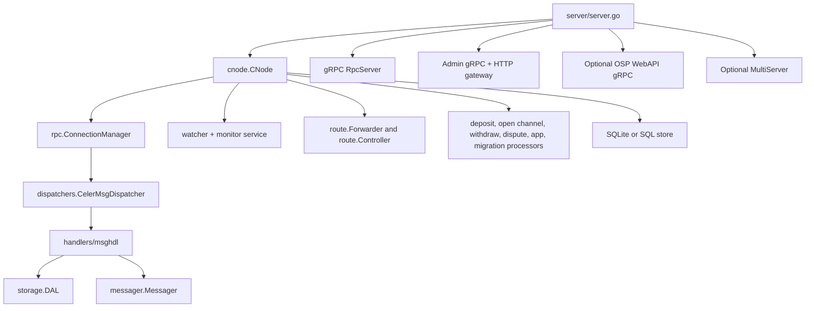

# AgentPay Backend Implementation

## Scope

This repo implements the off-chain backend of AgentPay. In practice, that means:

- The long-running OSP/service-node process in [server/server.go](../server/server.go)
- The shared node runtime in [cnode](../cnode)
- The off-chain payment message pipeline in [dispatchers](../dispatchers), [handlers/msghdl](../handlers/msghdl), and [messager](../messager)
- The storage, routing, deposit, dispute, and monitoring subsystems
- Client-side wrappers in [client](../client) and [celersdk](../celersdk)

The protocol and contract model live in the companion `agentpay-architecture` docs. This document focuses on how that model is implemented here.

## Runtime Model

At runtime, the backend is centered on one `CNode` instance. The server process wraps that node with public gRPC APIs, admin APIs, optional multi-server forwarding, and HTTP endpoints.



The most important architectural choice is that `server/server.go` does very little business logic itself. It mainly:

- Loads config and keys
- Creates the `CNode`
- Exposes RPC, admin, and optional OSP WebAPI services
- Hooks callbacks for send/receive/new-stream events

Most of the protocol behavior lives below that layer.

## Bootstrap Sequence

### 1. Process startup

The entry point is [server/server.go](../server/server.go). `main()` parses flags, reads keystore files, loads optional runtime config and routing data, then calls `server.Initialize(...)`.

Important startup flags include:

- `-profile`: chain and contract profile
- `-ks`: node keystore
- `-depositks`: optional separate signer for deposits
- `-storedir` or `-storesql`: storage backend
- `-port`: main gRPC port
- `-adminrpc` and `-adminweb`: operator/admin endpoints
- `-webapigrpc`: optional pay-centric OSP WebAPI gRPC endpoint for localhost/private same-host callers
- `-selfrpc`: optional second gRPC port for multi-server mode
- `-rtc`: runtime config file

### 2. Server initialization

`server.Initialize(...)` does three important things:

1. Loads and overrides the profile.
2. Creates the `CNode` with `route.ServiceProviderPolicy`.
3. Registers callbacks so the server can react to payment completion and newly connected peers.

See [server/server.go](../server/server.go) and [common/profile.go](../common/profile.go).

### 3. `CNode` construction

`cnode.NewCNode(...)` and `newCNode(...)` in [cnode/cnode.go](../cnode/cnode.go) set up the node in this order:

1. Connect to Ethereum RPC.
2. Create the signer and transactor pool.
3. Initialize storage and DAL.
4. Create the connection manager for peer streams.
5. Start the watch service and monitor service.
6. Construct the global node config with contract ABIs and addresses.
7. Start route control for OSP mode.
8. Start processors for deposits, open-channel, cooperative withdraw, disputes, app sessions, and channel migration.
9. Create the `Messager` and `CelerMsgDispatcher`.
10. Start the periodic OSP cleanup routine.

### 4. External servers

After `CNode` is ready, [server/server.go](../server/server.go) exposes three always-on or optional surfaces:

- Main `RpcServer` for clients and peers
- `AdminServer` for operational actions such as stream registration, channel opening, deposits, and token sending
- HTTP gateway under `/admin/` plus `/metrics`
- Optional OSP `WebApiServer` on `-webapigrpc` for pay-centric seller-OSP integrations that need a normal `rpc.WebApiClient` against the existing OSP runtime

If `-selfrpc` is set, the process also starts the `MultiServer` gRPC service used in shared-database, multi-server deployments.

The optional OSP WebAPI listener is intentionally narrower than the client-node WebAPI server in [webapi/api_server.go](../webapi/api_server.go): it reuses the already-running `CNode`, installs a callback fanout layer so existing OSP fee/delegate side effects are preserved, and leaves ambiguous channel-scoped calls such as `GetBalance` unimplemented.

## Core Packages

| Package | Role |
| --- | --- |
| [server](../server) | Process entry point, RPC server, admin server, HTTP gateway, multi-server service wiring |
| [cnode](../cnode) | Central runtime object that owns networking, monitoring, routing, processors, and persistent state |
| [dispatchers](../dispatchers) | Per-stream message dispatch loop that converts raw `CelerMsg` traffic into handler calls |
| [handlers/msghdl](../handlers/msghdl) | Message-specific logic for conditional pay setup, settlement, receipts, secrets, withdraw, and routing updates |
| [messager](../messager) | Outbound protocol message creation, forwarding, queueing, ACK/NACK handling, resend support |
| [route](../route) | Next-hop lookup, route-table building, router-registry monitoring, broadcast of routing updates |
| [storage](../storage) | SQLite or SQL-backed persistence plus the DAL transaction boundary used by protocol handlers |
| [deposit](../deposit) | Asynchronous deposit-job processing and batching |
| [dispute](../dispute) | On-chain fallback for payment/channel disputes and registry queries |
| [app](../app) | App-session support for virtual/deployed app logic that feeds payment conditions |
| [client](../client) | Go client wrapper around `CNode` for edge/client nodes |
| [celersdk](../celersdk) | Higher-level SDK interface intended for app/mobile integration |
| [chain](../chain) and [ledgerview](../ledgerview) | Contract bindings and read helpers for on-chain state |
| [common](../common), [ctype](../ctype), [config](../config), [rtconfig](../rtconfig) | Shared types, low-level identifiers, global config, and runtime-tunable values |

## Wire Contracts

Message and admin contracts live under [proto](../proto) and [webapi/proto](../webapi/proto). These are the source of truth — `messager`, `dispatchers`, and `handlers/msghdl` only realize what `.proto` says. Read these before changing message behavior, and regenerate matched `.pb.go` outputs as part of the same change.

| File | Role |
| --- | --- |
| [proto/message.proto](../proto/message.proto) | `CelerMsg` envelope, `CondPayRequest`/`CondPayResponse`, `PaymentSettleRequest`/`PaymentSettleResponse`, hop ACK/NACK |
| [proto/entity.proto](../proto/entity.proto) | `SimplexPaymentChannel`, `ConditionalPay`, `Condition`, `CooperativeSettleInfo`, signed-state structures |
| [proto/rpc.proto](../proto/rpc.proto) | `Rpc` service: `CelerStream` (bidirectional streaming peer transport) and the public `WebApi` service |
| [proto/osp_admin.proto](../proto/osp_admin.proto) | Admin gRPC: stream registration, `OpenChannel`, `Deposit`, `SendToken`, `CooperativeSettle` |
| [proto/multiserver.proto](../proto/multiserver.proto) | `MultiServer` gRPC used in shared-database, multi-server deployments |
| [proto/app.proto](../proto/app.proto) | App-session messaging used by the virtual-app layer |
| [proto/chain.proto](../proto/chain.proto) | Shared on-chain entity encodings used by handlers and storage |
| [proto/osp_report.proto](../proto/osp_report.proto) | Periodic OSP reporting payloads consumed by the explorer |
| [webapi/proto/web_api.proto](../webapi/proto/web_api.proto) | Pay-centric WebAPI used by client nodes and the optional `-webapigrpc` listener |
| [webapi/proto/internal_web_api.proto](../webapi/proto/internal_web_api.proto) | Internal WebAPI variants (non-blocking deposit/withdraw, etc.) reserved for in-process callers |

## Protocol-to-Code Mapping

### Stream establishment and peer auth

Outbound stream creation starts in `CNode.RegisterStream(...)` in [cnode/cnode.go](../cnode/cnode.go):

- Dial peer gRPC endpoint
- Open the `CelerStream`
- Send `AuthReq`
- Wait for `AuthAck`
- Register the stream with `ConnectionManager`
- Start a per-peer dispatcher goroutine

Inbound stream handling starts in `server.CelerStream(...)` in [server/server.go](../server/server.go):

- Expect the first message to be `AuthReq`
- Validate it with `cNode.HandleAuthReq(...)`
- Optionally reply with `AuthAck`
- Attach the authenticated stream via `cNode.AddCelerStream(...)`

This is the point where the runtime turns a transport connection into a protocol peer.

### Message ingress and dispatch

Every authenticated stream gets its own dispatcher channel via `NewStream(...)` in [dispatchers/celer_msg_dispatcher.go](../dispatchers/celer_msg_dispatcher.go). `Start(...)` then loops forever:

- Read one `rpc.CelerMsg`
- Build a `common.MsgFrame`
- Create a new handler set
- Dispatch by message type
- Record metrics and persistence-oriented log entries

The handler switch lives in [handlers/msghdl/celer_msg_handler.go](../handlers/msghdl/celer_msg_handler.go).

### Conditional payment setup

Source-side setup usually begins from one of two places:

- Admin/API entry points such as `SendToken(...)` in [server/server.go](../server/server.go)
- Client-side helpers such as `AddBooleanPay(...)` in [cnode/pay.go](../cnode/pay.go)

`AddBooleanPay(...)` does the source-side payment preparation:

- Fill the payment timestamp
- Add a hash-lock when needed
- Set the pay-resolver address
- Persist the generated secret if a hash-lock was added
- Ask the `Messager` to emit a `CondPayRequest`

Inbound validation happens in `HandleCondPayRequest(...)` and `processCondPayRequest(...)` in [handlers/msghdl/handle_cond_pay_request.go](../handlers/msghdl/handle_cond_pay_request.go). That code is where the single-hop protocol becomes durable state:

- Verify peer signature and sequence number
- Verify deadlines and route-loop constraints
- Enter a DAL transaction
- Validate the simplex/channel transition through the FSM layer
- Insert or update payment records
- Persist the new co-signed state
- Reply with `CondPayResponse`

This is the core implementation of the single-hop setup flow described in the architecture docs.

### Cooperative settlement

The source or receiver can start settlement through helpers in [cnode/pay.go](../cnode/pay.go):

- `ConfirmBooleanPay(...)`
- `RejectBooleanPay(...)`
- `SettleOnChainResolvedPay(...)`
- `ClearPaymentsInChannel(...)`

On the receiving side, [handlers/msghdl/handle_pay_settle_request.go](../handlers/msghdl/handle_pay_settle_request.go) validates the new simplex state and the requested removals from the pending-pay list, then updates payment state and triggers receive callbacks when appropriate.

The settlement path is intentionally symmetric with setup:

- `Messager` sends settle requests or settle proofs
- the handler verifies the updated state against storage
- the DAL transaction applies the channel/payment mutation
- the peer receives an ACK or an error state

### Sliding-window style ACK/NACK handling

The payment protocol uses dependent simplex-state updates, so resend logic is not a generic packet retry layer. The queue and ACK/NACK mechanics live in [messager](../messager), with handler support in `HandleHopAckState(...)` inside [handlers/msghdl](../handlers/msghdl).

The important implementation point is that message ordering and resend are tied to stored simplex sequence numbers, not treated as stateless transport retries.

### Direct pay fast path

The repo also has a direct-pay optimization for unconditional payments to the next hop. `Messager.IsDirectPay(...)` in [messager/messager.go](../messager/messager.go) identifies this case. On inbound processing, the handler can mark the payment done immediately without waiting for the full end-to-end conditional workflow.

That is used for cases such as fee-like or prize-like transfers where the peer is also the destination.

## Routing and Relay Behavior

Routing is split into two concerns:

1. `route.Forwarder` chooses the next hop for a destination/token pair.
2. `route.Controller` maintains the routing picture for OSP/service nodes.

The controller in [route/controller.go](../route/controller.go) does the OSP-specific work:

- Query the on-chain `RouterRegistry`
- Refresh router registration when needed
- Monitor router updates from chain events
- Recover and rebuild routing tables
- Broadcast routing updates to peer OSPs
- Report OSP info to the explorer when configured

This matches the protocol goal that relay nodes should stay simple in payment handling while still maintaining a network-level routing view.

## Storage and Transaction Boundaries

`CNode.setupKVStore(...)` in [cnode/cnode.go](../cnode/cnode.go) selects the backend:

- `StoreDir` means a local SQLite database under `<storedir>/<ethaddr>/sqlite/celer.db`
- `StoreSql` means a shared SQL database, typically CockroachDB in this repo's operational examples

The rest of the code works through [storage.DAL](../storage), not raw SQL. That matters because protocol handlers depend on DAL transactions to atomically:

- Read the current simplex/channel state
- Validate the transition
- Update payment rows
- Update the co-signed simplex state

Without that DAL layer, the sliding-window and settlement logic would be much harder to keep consistent.

## Monitoring, Disputes, and Background Jobs

`CNode.initialize(...)` wires two chain-facing layers:

- A watch service for raw chain/event observation
- A monitor service that manages event callbacks and timing

These feed the processors that need chain knowledge:

- [deposit](../deposit) for queued deposit work
- [dispute](../dispute) for channel/payment fallback and registry checks
- [cnode/cooperativewithdraw](../cnode/cooperativewithdraw) for cooperative withdraw handling
- [route](../route) for router-registry observation

OSP nodes also run `runOspRoutineJob()` in [cnode/cnode.go](../cnode/cnode.go), which periodically clears expired or already-resolved payments with peer OSPs.

## Multi-Server Mode

The repo supports two deployment styles.

### Single-server mode

This is the default and the easiest to understand:

- local stream ownership
- local storage or per-node storage directory
- no inter-server forwarding

### Multi-server mode

This is enabled when the profile has both `SelfRPC` and `StoreSql` set. The helper logic lives in [cnode/multiserver.go](../cnode/multiserver.go).

In this mode:

- client-to-server ownership is stored in SQL
- the process exposes a second gRPC service (`MultiServer`)
- a message for a non-local client is forwarded to the owning server instead of dropped

This lets multiple frontends share a database while still presenting a single logical backend network.

## Client-Side Node Wrappers

Although this repo is centered on OSP/backend nodes, it also includes client-side node wrappers.

- [client/celer_client.go](../client/celer_client.go) wraps `CNode` for direct Go usage and handles callbacks, stream registration, and common channel/payment actions.
- [celersdk/api.go](../celersdk/api.go) exposes a higher-level SDK surface intended for applications that want to open channels, deposit, withdraw, and send payments without managing the lower-level node details.

These packages reuse the same `CNode`, storage, and protocol pipeline. They are not a separate protocol implementation.

## Tests as Living Design Examples

Two directories are especially useful when reading the implementation:

- [test/e2e](../test/e2e) shows how the full backend is exercised against a local chain and generated profiles.
- [test/manual](../test/manual) shows the operator workflow for starting multiple OSPs, registering streams, opening channels, and sending payments.

The focused e2e command below is a good way to study a concrete conditional-payment path end to end:

```bash
go test ./test/e2e -run '^TestE2E$/^e2e-grp2$/^sendCondPayWithErc20$'
```

For someone changing payment-path code, these tests are usually the best executable documentation in the repo.